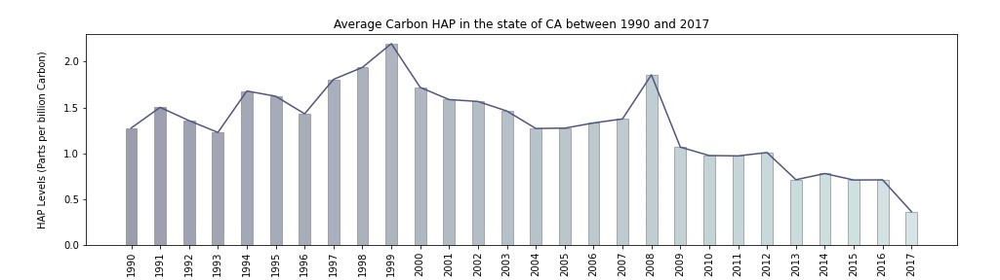
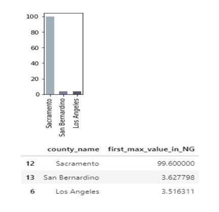

## Hazardous Air Polluants (HAP) in CA

Air pollutants are substances found in the atmosphere that are harmful
to human health and other living organisms. Air pollutants can be found
in different states, particulate, gaseous and biological molecules.

HAP also known as toxic air pollutants which is a subcategory of air
pollutants is defined by the EPA as “pollutants that are known to cause
cancer or other serious health effects, such as reproductive effects or
birth defects, or adverse environmental effects”.

Examples of HAP include benzene, which is found in gasoline, mercury,
lead compounds, methylene chloride etc. The EPA is currently working to
reduce air emissions of 187 HAP to the environment.

## Important Files / Folders:
*  Download [Presentation](HAP_Presentation.pptx)
*  Download [Project Detailed Report](HazardousAirPolluants_Summary.docx)  
*  View samples of [Cleaning and Analysis code](data_clean_and_analysis) 

## Our Analysis

Our analysis is based on daily HAP recorded different states in the US
from 1990 – 2017. The data was then grouped in 2: Carbon HAP and
Non-carbon HAP.

The goal of or analysis is to obtain/ get in-sight into the HAP levels
(for one state) over the duration of the data and get some insight into
the following questions.

  - Which counties have the highest and lowest HAP?

  - What are the best and worst counties for carbon and non-carbon HAPs
    in CA?

  - What is the most prominent HAP?

  - What populations were at risk?

## Cleaning our data

Our dataset was obtained from Kaggle. The source dataset was made up of
a total of 8 million+ rows and 29 columns.

We decided to analyze the data from the state of California and reviewed
the entire dataset for NaN values, next we decided to analyze the data
from the state of California and removed/ dropped columns that did not
have relevant information to our analysis. Examples of such columns
were:

“CBSA Name”: The name of the core bases statistical area (metropolitan
area) where the monitoring site is located.

“Method Name”: A short description of the processes, equipment, and
protocols used in gathering and measuring the sample

“AQI”: The Air Quality Index for the day for the pollution, if
applicable

These activities helped narrow down the number of rows to **872461** and
**17** columns for the state of California. Of these datasets the
non-carbon HAP (with units other than parts per billion carbon) were
made up of **479734** rows and **17** columns and the carbon HAP was
made up of **392727** rows and **17** columns.

New columns were created as well during our analysis, example of these
columns is:

“month”, “day” and “year”: to help run analysis without using
conversions.

“first\_max\_value\_in\_NG” – to convert the “units\_of\_measure” for
daily recordings from microgram to nanogram etc.

## Summary Statistics

The summary statistics was performed on both the source dataset from
Kaggle (8 million+) and the cleaned data for the state of California,
this was to help determine if the outliers in California dataset were to
be kept or dropped. From the summary statistics for the entire data, for
the state of California, carbon HAP and non-carbon HAP dataset is below.

|                    | Kaggle Dataset | California Dataset | Non-carbon HAP Dataset | Carbon HAP Dataset |
| ------------------ | -------------- | ------------------ | ---------------------- | ------------------ |
| Mean               | 0.561897       | 3.165112           | 2.740759               | 1.304063           |
| Median             | 0.000890       | 1.000000           | 1.000000               | 0.120000           |
| Standard Deviation | 13.62156       | 15.968621          | 11.348834              | 14.876403          |
| Maximum Value      | 20000.000000   | 9051.100000        | 1112.300000            | 9051.100000        |

## Data Visualization

As stated above the dataset was subcategorized into 2, Carbon based HAP
and Non-carbon-based HAP. Using matplotlib, we have a bar plot
with an overlapping line plot of the 2 subcategories for the
state of California from 1990-2017. The average HAP levels of the of the
data were used for this analysis.

## Non-carbon-based HAP

From the chart, we see a decline in HAP levels for non-carbon-based HAPs 
from 1990-1993, after 1993 we see an increase in
the non-carbon HAP levels until 2003 where a huge drop is observed. The
pattern follows the drop and rise but it is interesting to note the
great increase in 2017. Our analysis is going to explore the data by
looking at counties from the start date of the data 1990
which will be base of our data to the end date of the data in 2017. We are
going to find which counties contributed to the spike, what non-carbon
HAPs were emitted and what cities within the counties emitted the HAPs
using a heatmap.

**What are the best and worst counties for non-carbon and carbon HAPs in CA?**

From the summary statistics table above, we see the non-carbon HAP have
a higher mean than the carbon HAP which is better, considering carbon
HAPs are much more influential in causing harm to the people and the
environment in general.

We then proceeded to create bar charts for every year of the data
available to visualize the top five best and worst counties for carbon
and non-carbon HAP.

<strong>Click to see top five best and worst counties for Non-Carbon HAP</strong>

 

Orange county had a very high spike of non-carbon HAP in the years 2004
to 2006. The non-carbon HAPs were around 40 when the mean is around
3.19.

County of Marin again was in the bottom five for non-carbon HAP from the
year 2007 to 2016. This shows that Marin has a good control on both
carbon and non-carbon HAP emissions.

2017 saw a spike for non-carbon HAP across all counties with the bottom
five jumping almost 20 times the average in 2016. It might be because of
a major natural disaster or a major catastrophe that caused the spike
across all counties.

 

## Carbon based HAP

From the chart for carbon HAPs, we see some rise and fall in the levels
of HAPs as well but unlike in the case of the of non-carbon HAPs where
sharp rises and drops are observed. A common trend was observed in 1993
where there was a significant drop in both HAPs carbon and non-carbon.

Our analysis is once again going to explore some select years where
increases in the HAP levels were observed starting with 1990 and ending
with 2017.

<strong>Click to see top five best and worst counties for Carbon HAP</strong>

The above charts show the carbon HAP levels in 2016 and 2017 and
Riverside is clearly the worst county in regard to carbon HAP. While
others are closer to the mean Riverside is almost 5 times the mean in
both years. Barring Riverside, the highest carbon HAP has been under 3
since 2008.

Since 1993 bottom 5 have an average under than 1 NG of carbon HAP and
since 2000 bottom 5 have an average of under 0.5 NG carbon HAP which is
less than 50% of the mean.

 

**Are the HAP levels increasing or decreasing for each county? And What population is currently at risk?**

After the analysis of the counties with the highest HAP levels/
emissions we the decided to further explore which HAPs were emitted by
the counties that had the highest emissions to give us an idea of the
population at risk. We selected years with the most increase or decrease
in HAP levels to help with our exploration.

## Non-Carbon HAP

The table above gives a snapshot of the top 3 contributing counties and
the top 3 non-carbon HAPs that were emitted by the counties respectively
in the order of highest to lowest over some select years.

And below is the snapshot for the top 3 counties with the most
non-carbon HAP and the top 3 HAP for each county for 2017 in the form of
a pie chart.

**Non-carbon HAPs for 2017**

The breakdown of the HAPs per county are depicted below:

<table><tr>
<td></td>
<td></td>
<td></td>
</tr></table>

It was observed that manganese was the highest non-carbon HAP emitted
over the years. Manganese is mainly used by the steel industries as a
deoxidizing and desulfurizing additive to help make the steel malleable
for forging. Chromium is also used in the steel industry to harden steel
during the manufacturing of stainless steel, they are also used as
industrial catalysts and pigments. Next prominent non-carbon Hap is
Nickel which is also used in the steel industry as ferronickel. Other
uses of nickel include batteries, kitchen ware just to name a few. The
presence of these HAPs along with the uses of the highest 3 HAPs leans
towards the presence of a steel factory in these counties or surrounding
counties. All population are at risk as they can develop illness such as
metal fume disease, Pontiac and even Parkinson-like tremors but the
population with auto-immune diseases, cancer etc.

## Carbon HAP

The table above gives a snapshot of the top 3 contributing counties and
the top 3 carbon HAPs that were emitted by the counties respectively in
the order of highest to lowest over some select years.

And below is the snapshot for the top 3 counties with the most carbon
HAP and the top 3 HAP for each county for 2008 in the form of a pie
chart.

**Carbon HAPs for 2008**

<table><tr>
<td></td>
<td></td>
</tr></table>

The breakdown of the HAPs per county are depicted below:

<table><tr>
<td></td>
<td></td>
<td></td>
</tr></table>

Benzene was the prevalent carbon HAP in California, carbon being a very
reactive can react with many compounds and metals to form several.
Tourism, migration, natural disasters all contribute to the emission of
carbon HAPs. Benzene is used to make other chemicals like plastics
resins. 13-Butadiene is a versatile material that is used for synthetic
rubbers. Dichloromethane are industrial solvent found in paint removers
etc. Benzene, which is very carcinogenic causes cancer, other compounds
causes birth defects and many more. Like in the case of the non-carbon
HAP affects all population are affected.

These HAPs also affect the air quality and gives rise to fog/ smog,
allergies and other respiratory diseases.

**What populations were at risk?**

### Heatmaps for Carbon and Non-Carbon Haps

The heatmaps were generated for the purpose of visually displaying where
the data was captured during the timeframes of the study and to allow
viewers to develop inferences as to where the data would be clustered
and what populations might be affected by the location of these HAPs.
The heatmaps are displayed with the mean of the gathered data being
displayed, and the maximum value of all means being displayed as the
maximum intensity of the heatmap, so as to allow for an effective index.
